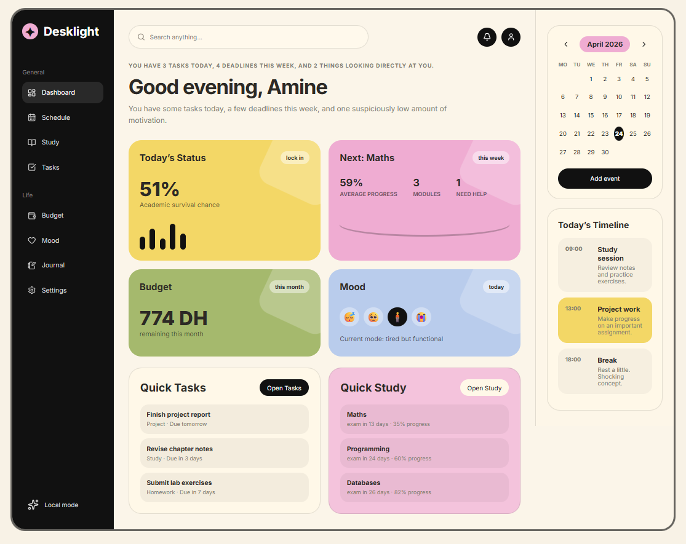
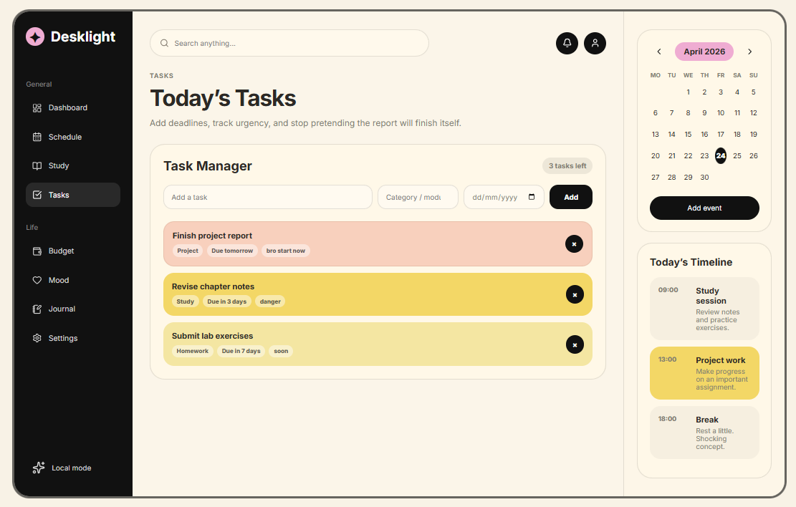
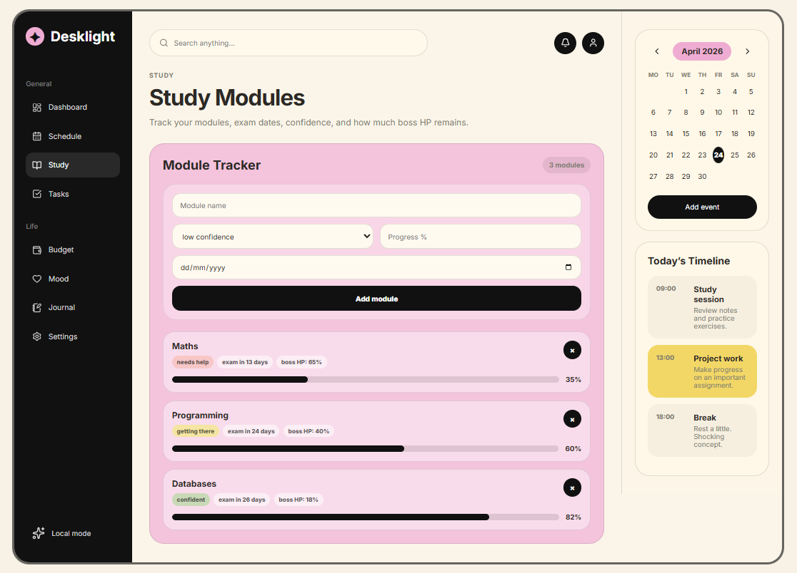
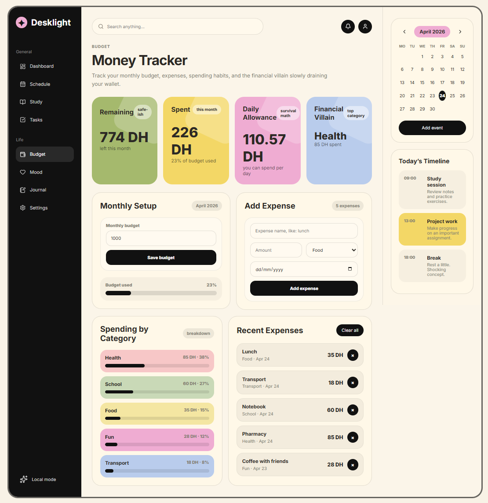
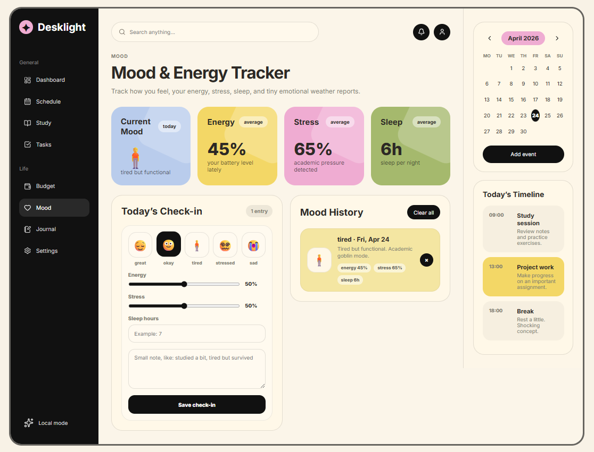
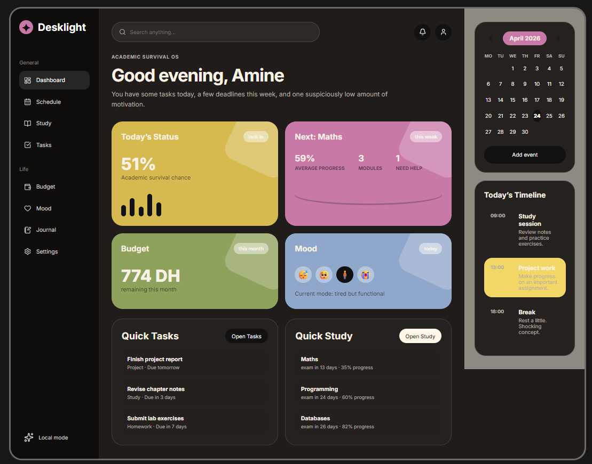

# Desklight

Studly is a cozy student life dashboard built with HTML, CSS and JavaScript.  
It helps students manage tasks, schedules, budgets, mood check-ins and journal entries in one aesthetic place.

## Features

- Task manager with deadlines and automatic urgency labels
- Study module tracker with progress and exam countdowns
- Schedule planner with events and today’s timeline
- Budget tracker with expenses, categories, remaining money, and daily allowance
- Mood and energy tracker
- Journal page with search and categories
- Theme customization
- Show/hide dashboard cards
- Export/import data
- LocalStorage data saving

## Tech Stack

- HTML
- CSS
- JavaScript
- LocalStorage

## Screenshots

### Dashboard

### Tasks

### Study Modules

### Budget Tracker

### Mood Tracker

### Dark Mode

## How to Use

1. Open the dashboard.
2. Add your tasks, modules, events, expenses, mood entries, and journal notes.
3. Customize the dashboard from Settings.
4. Export your data from Settings if you want a backup.

## Future Improvements

- Mobile navigation menu
- Search functionality
- Optional login and cloud sync
- More theme options
- Better dashboard analytics

## Author

Made by Mohamed Amine DHAINI
